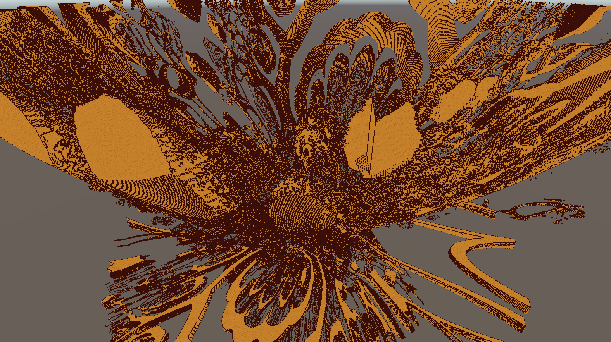

# Unity 程序化体素地形

## 概述
这是 **Unity-Procedural-Voxel-Terrain** 的优化版本，完全 **移除了 CPU Jobs 体素生成**，改为 **GPU 计算生成体素**，CPU 仅负责 **网格构建** 和prefab生成

删除了GPU的**网格构建** 因为实际还是要回传创建碰撞体 而且做游戏的情况下需要更好的自定义网格因此放弃全部过早优化设计。

算了以后再说 没有方便的ecs没法玩
## Todo
- **GPU 只回传体素数据，使用体素生成贪婪碰撞体，从而无需回传网格，并直接使用 `Graphics.DrawProceduralIndirect` 在 GPU 上渲染区块**

# Unity-Procedural-Voxel-Terrain

Procedural Voxel Terrain Project

# Mesh Optimization

## Stupid Method

## Culling Method

## Greedy Meshing Only Y Axis

## Greedy Meshing

# Texture Mapping

# Ambient Occlusion

## With Greedy Meshing

## License

This project is licensed under the MIT License - see the [LICENSE](LICENSE) file for details
